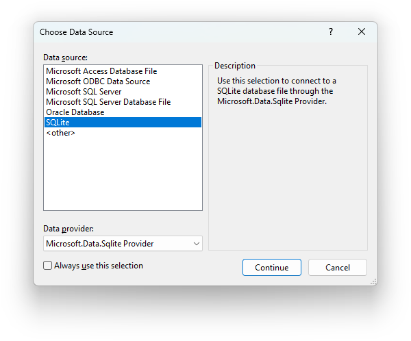
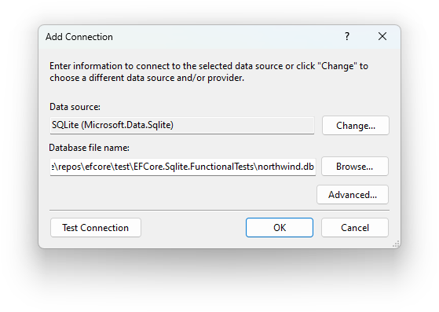
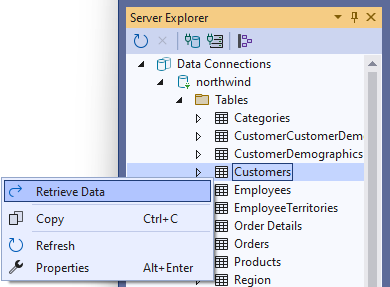
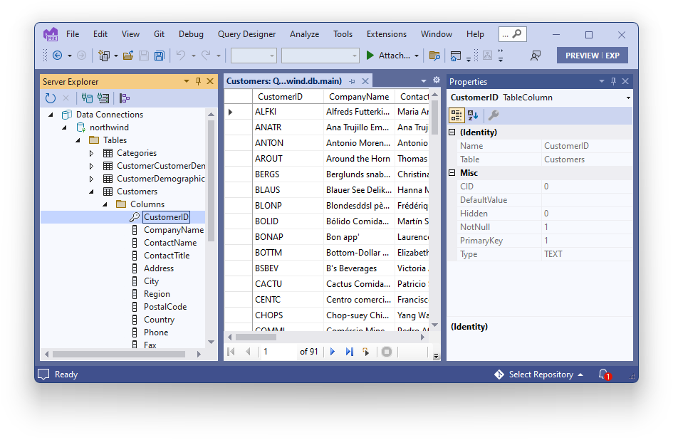

VisualStudio.Data.Sqlite
========================

A Data Designer Extensibility (DDEX) provider for Microsoft.Data.Sqlite.

CI builds are available on the [Open VSIX Gallery](https://www.vsixgallery.com/extension/0b471821-68a4-49dd-b175-e6daf4e5cebf). Install [this extension](https://marketplace.visualstudio.com/items?itemName=MadsKristensen.VSIXGallery-nightlybuilds) to get automatic updates.

Screenshots
-----------

